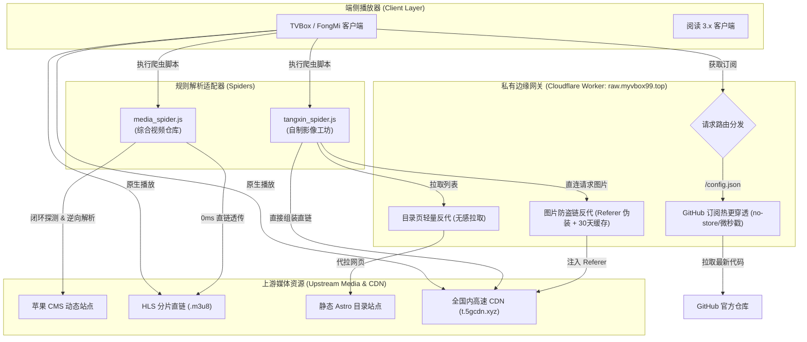

# 系统架构设计 (Architecture Specification)

## 1. 总体设计概览

本项目采用「端侧轻量适配器 + 边缘路由网关 + 高速媒体直连」的三层流媒体聚合架构，面向 CatVod / QuickJS 及 Legado 协议规范构建。

---

## 2. 爬虫引擎设计规范 (Adapters)

### 2.1 综合视频仓库 (`media_spider.js`)
* **核心职责**：全量常规视频索引、多主域容灾与防失效探测。
* **逆向链路**：
  * 基于苹果 CMS v10 架构，动态截取视频播放参数 `(AID, ASID, ANID, AK)`。
  * 发起 `POST /static/count.php` 逆向计算，Base64 解密生成 HLS 真实地址。
* **0ms 前置解析**：
  * 解密逻辑全部置于 `detail()` 阶段执行，将直链直接填入 `vod_play_url`。
  * `play()` 耗时严格为 0ms，杜绝底层播放器 2000ms 超时判定。
* **物理切割防错位**：
  * 列表页放弃贪婪跨行正则，先按 `
` 物理卡片切块，局部提取属性。

### 2.2 自制影像工坊 (`tangxin_spider.js`)
* **核心职责**：创作者短视频索引、国内直连流媒体加速与分类展示。
* **无逆向直链架构**：
  * 视频地址静态对应 `https://t.5gcdn.xyz/videos/{id}/index.m3u8`，国内 CDN 节点直连秒开。
* **图片防盗链破除**：
  * 原站封面图强制验证 `Referer: https://tangxinvlog.app/`。由于 Android 原生图片控件（Glide）无法动态注入此 Header，爬虫将封面统一定向到专属代理 `https://raw.myvbox99.top/tx-img/{id}.jpg`。
* **分类去重与推荐接管**：
  * 规范分类字典（'1'~'13'），移出「精选合辑」标签。
  * TVBox 客户端默认的「推荐」Tab 专属于 `homeVod()`，统一渲染精选流，界面无冗余。

---

## 3. 私有边缘路由网关 (`worker/index.js`)

部署于海外免实名 Cloudflare Worker，域名绑定 `raw.myvbox99.top`。

| 路由路径 | 目标上游 | 核心处理逻辑 | 缓存策略 |
|---|---|---|---|
| `/tx-img/{id}.jpg` | `t.5gcdn.xyz/videos/{id}/cover.jpg` | 注入 Referer 与移动端 UA，突破 403 防盗链 | `public, max-age=604800, s-maxage=2592000` (边缘 30 天) |
| `/tx/{path}` | `tangxinvlog.app/{path}` | 代理拉取主站 HTML，穿透网络屏蔽 | `public, max-age=180` (边缘 3 分钟) |
| `/{path}` (默认) | `raw.githubusercontent.com/{path}` | 注入微秒时间戳 `_t`，打穿 Fastly CDN 缓存 | `no-store, no-cache, must-revalidate, max-age=0` (实时穿透) |
